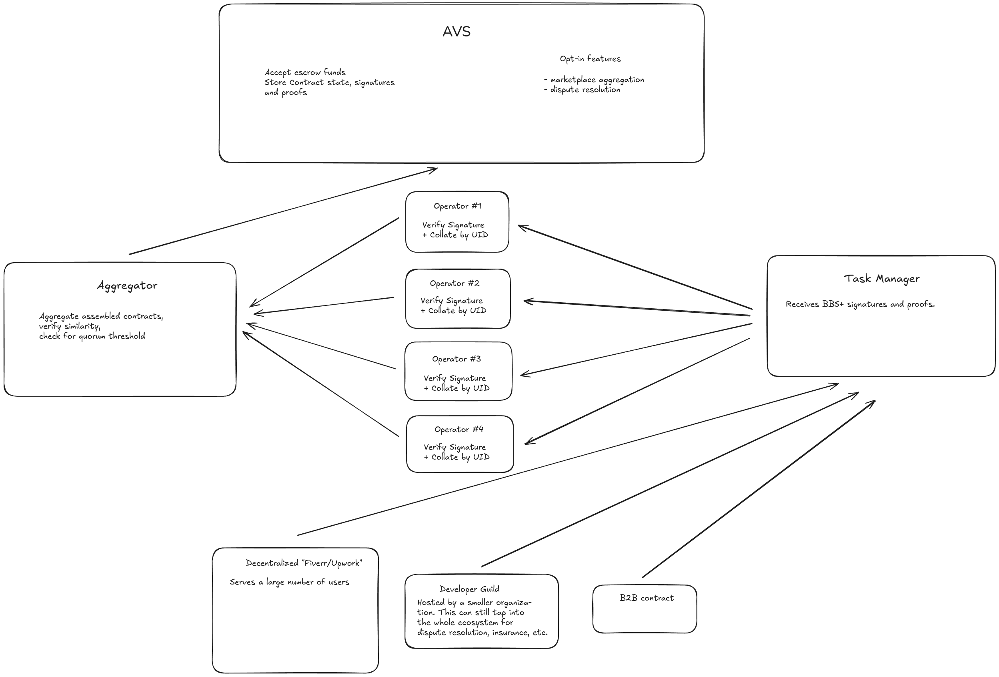

# avsthon-work

Submitted to the 2024 AVSthon's main track.

## Motivation

Current State of Peer-to-Peer Platforms

Today's peer-to-peer platforms often exploit workers. These platforms impose hidden fees and unfavorable conditions that trap users within the ecosystem. For instance, an Uber driver can't easily leave and start a private taxi service without a significant pay cut, as their experience data is locked within the platform.

Bounty programs have also become mainstream, but they lack transparency, putting participants at risk, such as not receiving payouts despite completing tasks.

### Our Solution: Transparent, Secure Peer-to-Peer System

With Actively Validated Services (AVSs) and open architectures, we can create a fairer ecosystem. Our approach centers on escrow payments to secure transactions and a public reputation system to reduce losses from malicious actors. By restaking assets at a 4% interest rate and maintaining a public record of each participant, we can effectively manage risk to keep it below reward levels.

### Our Objectives

We aim to address key issues with peer-to-peer job platforms:

- Pooled Security via restaked escrow payments
- Payment Security through restaking and slashing mechanisms
- Fraud Prevention with transparent reputation tracking
- Free-Market Governance

Our system is open and opt-in by default, and the frontend can be self-hosted. Users simply register as operators to join. Each contract defines its own risk level, offering options like independent dispute resolution and secured payments.

## Architecture

A bottom up description:

1.  Front-end applications
    - Marketplace e.g. Upwork
    - Self hosted by organization e.g. bounty program
    - B2B e.g. Freelance-to-SMEs
    - Task generator
2.  Operator
    - the operator can handle escrow payments and thus earning interest for the employer via restaking
    - following an on-chain signature verification the contract data can be aggregated into a marketplace
    - operators can handle dispute resolutions and earn some of the restaked funds
3.  AVS (ServiceManager + TaskManager)
    - Escrow payments restaked
    - For each contract participant a signature and proof is published. Each of these have to be validated and aggregated.

The off-chain node code is located in the `avs/aggregator` and `avs/operator` directories.  
The `avs/contracts` directory contains the AVS contacts, the `ServiceManager` and `TaskManager`.  
`frontend` directory contains a proof-of-concept freelancer platforms, where users can create contracts, update their state w/ signatures and make escrow payments.  

## Technical Details

### Cryptography

The ideal cyrptographic scheme would be BBS+ and JSON-LD through which we can create proofs that are easier to build a marketplace around.
In a employer-employee contract each party has ownership of their information e.g. e.g. name, address, etc. and co-ownership of the contract's
data e.g. price, milestones, etc.
The marketplace aggregator can only include information that was signed and shared with by the respective owner. In case of co-ownership both
parties have to agree to it.
Each party can individually create circuits of co-owned data e.g. they can prove that the contract's price falls in a certain range.

### Economics

The parties optionally can keep their token e.g. Ether, any ERC20, LSTs, etc. and earn money by securing the AVS.
The escrow payments are kept in the AVS in the time between start of a contract and the conclusion of the contract.
This sum and the rewards earned on it secures the whole ecosystem.
Through stake delegation, slashing and a reputation system we can set up a dispute resolution system.

## Deployments

Holesky testnet:

## Future plans

Implement a

## Resources

[Verifiable Credentials Flavors Explained](https://docs.google.com/document/d/1MqNTo7hIDBKZjLq7eZ7yaPsNFg6Ea3YahR8RR5RtSOM)  
[A linked data proof suite for BBS+ signatures](https://github.com/mattrglobal/jsonld-signatures-bbs)  
[EigenLayer Contracts](https://github.com/Layr-Labs/eigenlayer-contracts/tree/dev/docs#depositing-into-eigenlayer)  
[AVS Book](https://eigenlabs.gitbook.io/avs-book)